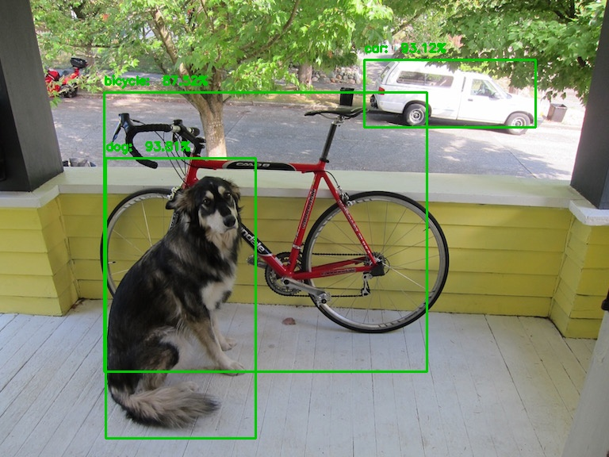

# Project Title
Object detection using Faster R-CNN

## Description
We utilize Faster R-CNN for object detection in images, employing the VOC dataset.

## Getting Started

### Dependencies
- OS: Linux 22.04.5 LTS or higher
- Python 3.10.12 or higher
- NumPy 2.1.3 or higher
- PyTorch 2.6.0 or higher
- OpenCV 4.11.0.86 or higher
- tqdm 4.67.1 or higher
- scikit-learn 1.6.1 or higher
- argparsee 1.4.0 or higher
- torchmetrics 1.7.0 or higher
- tensorboard 2.19.0 or higher

### Downloading the Dataset
- If you haven't had VOC dataset downloaded in your system, follow these steps:
1. Go to `train.py`
2. In `train_set` variable, switch `download` value from `False` to `True`.
3. The system will start downloading and extracting the dataset.
4. When the downlaod process finishes successfully, revert the `download` value to `False`.
5. Then you can remove the zip folder.
6. For detailed information, please visit [VOC Dataset](https://pytorch.org/vision/main/generated/torchvision.datasets.VOCDetection.html)

### Executing the Program
1. Install PyTorch (if not already installed):
```
pip install torch
```

2. Install NumPy (if not already installed):
```
pip install numpy
```

3. Install OpenCV (if not already installed):
```
pip install opencv-python
```

4. Install tqdm (if not already installed):
```
pip install tqdm
```
5. Install scikit-learn (if not already installed):
```
pip install scikit-learn
```
6. Install argparse (if not already installed):
```
pip install argparse 
```
7. Install torchmetrics (if not already installed)
```
pip install torchmetrics
```
8. Install tensorboard (if not already installed)
```
pip install tensorboard
```

8. Run `train.py` to train the model. You can modify hyperparameters in `get_args()` function.
9. Download an image that contains objects. Or you can test with `input.jpg`
11. Run `inference.py`. Rememeber to check for the hyperparameters in `get_args()` function.

## Sample Result


## View the Tensorboard
To view the tensorboard, follow these steps:
1. Open the terminal.
2, Execute `tensorboard --logdir=[Your tensorboard folder path]`
3. Follow the link [http://localhost:6006/] in the browser.
